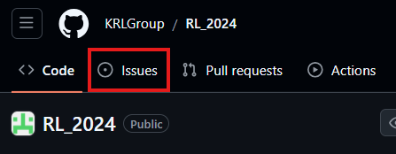
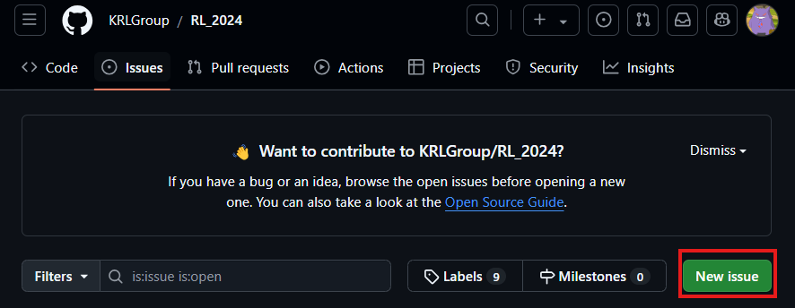
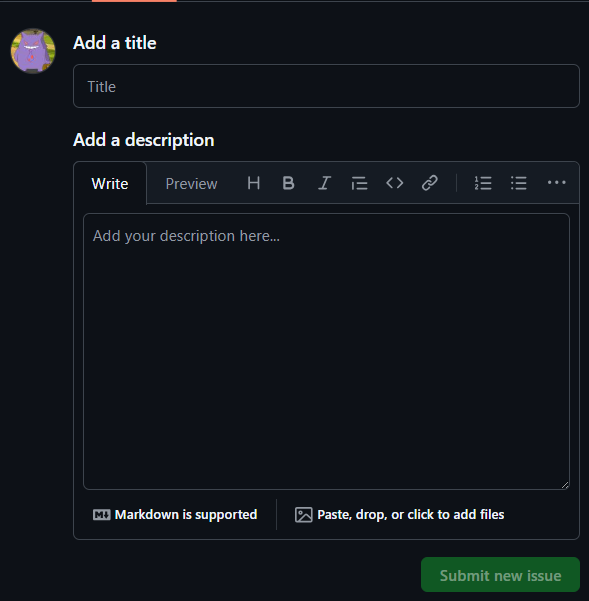
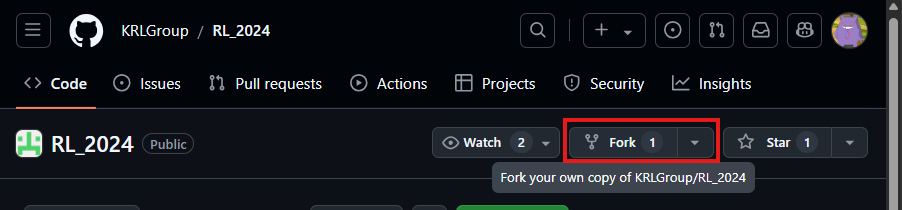
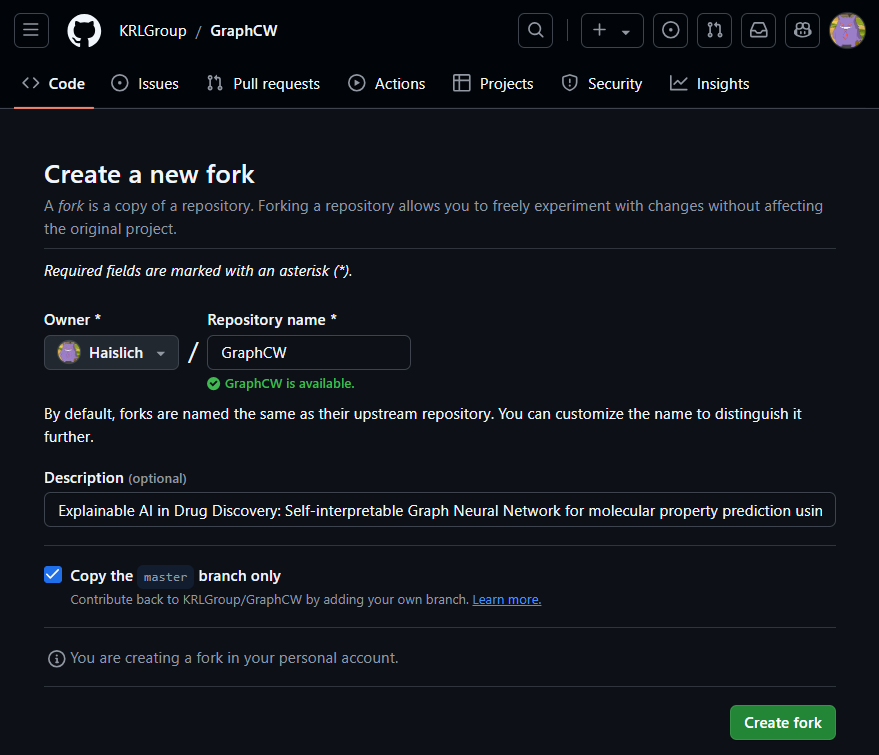
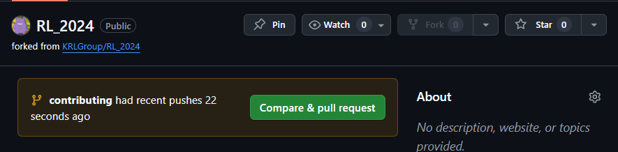

# Introduction

Git is a distributed version control system used to track changes in source code during software development.
It enables multiple developers to work on the same project simultaneously without overwriting each other's work.

Generally speaking, a Git repository allows developers to manage the project's code, track changes over time, collaborate with others, and maintain different lines of development.

## Issues

In Git, an issue is a way to track tasks, bugs, or feature requests related to a project.
Think of it as a ticket or a to-do item that can be used to organize and prioritize work within a team.

|You can find issues here|
|:-:|
||

When you create an issue, you can describe the problem or task, add labels to categorize it, and assign it to specific people who are responsible for addressing it.

|You can create an issue by clicking on the `New Issue` button|
|:-:|
||

For example, if you find a bug in your code or want to suggest a new feature, you can create an issue.
This issue will have a title and description where you explain what needs to be done.

|Example of a new issue|
|:-:|
||

You can also link issues to specific parts of the codebase or commits to track progress.
Once the issue is resolved, you can close it to mark the task as complete.

## Contributing

In GitHub, a contribution refers to any meaningful action or activity that helps improve a project.
This can include a variety of things, such as submitting code changes, reporting issues, reviewing pull requests, or even contributing to documentation.
Contributions are an important part of how open-source projects, and many collaborative projects in general, operate because they allow multiple people to work together and improve the project over time.

When you make a commit (a change to the code) or open a pull request (a proposal to merge your changes into the project), these are considered direct contributions.
<!-- This needs TA attention, thius is a contribution, but do you mean this or what ? -->
If you're not coding but still helping by reporting bugs or suggesting new features through issues, that's also considered a contribution.
Even things like improving the project's documentation, helping with testing, or providing feedback on code reviews can count as contributions.

### How to contribute

Before you can start making changes, you'll need to fork the repository and clone it to your local machine.
A fork in GitHub is essentially a personal copy of someone else’s repository that you make on your own GitHub account.
When you fork a repository, you're creating your own version of it, which allows you to make changes without affecting the original project.
You can use this fork to experiment, add features, or fix bugs, and later, if you want, you can suggest your changes to the original project by creating a pull request.

|You can fork a repo with this button|An example of how you finalize the forking|
|:-:|:-:|
| ||

On the other hand, cloning is when you download a copy of a repository (whether it's your own, someone else's, or a fork) onto your local machine so you can work on it offline.
When you clone a repository, you're copying the entire project, including all files and history, to your computer.
This lets you edit files, track changes, and commit new code locally.
You can fork this repository in your desired location by typing in your terminal:

```bash
git clone https://github.com/[your github username]/RL_2024.git
```

But why not just clone the repository?

When you clone a forked repository, you're downloading the forked version, which is your personal copy of the project.
This means that, by default, you have the ability to push changes back to your own fork (because you "own" it on GitHub), but you can’t directly push changes to the original repository unless you have permission from the original owners.
To propose changes to the original project, you would have to create a pull request from your fork.

When you clone a repository directly from someone else’s GitHub (without forking it first), you're working directly on their version, but you likely won't have permission to push changes back to it.
You can still make changes on your local machine, but if you want to suggest those changes to the original project, you would still need to fork it and submit a pull request through your fork.

It's a good practice to create a new branch for each contribution you make.
This keeps your changes organized and separated from the main project, which can make the process of reviewing and merging your changes easier.
You can create a new branch by using the command

```bash
git checkout -b [branch-name].
```

Once you have set up your local repository and created a new branch, you can start making changes.
Now, edit the files and make the changes you want to contribute.
After making changes:

```bash
git add .
```

Note, every file that you've modified in the process will be pushed, this means that if you have made any test it will be pushed.
You can have a finer control by adding only the files that you actually modified

```bash
git add modified_file
```

Commit your changes:

```bash
git commit -m "Description of the changes you made"
```

Once you have commited the changes, push the new branch to your forked github repository:

```bash
git push origin [branch-name]
```

Now that your changes are on your GitHub fork, you can submit a pull request.

1. Go to your fork on GitHub.
2. You’ll see a Compare & Pull Request button at the top of your repository (GitHub usually detects that you pushed a new branch). Click that button.

    

3. Review the changes you’ve made to ensure everything looks correct.
4. Add a title and description explaining what changes you’ve made and why they are necessary.
5. Choose the base repository (the original project) and the base branch (usually main) into which you want to merge your changes. Your pull request will compare your changes with that branch.
6. Click Create Pull Request.

After submitting the pull request, the repository maintainers will review your changes.
They might ask questions or request modifications. You can push additional changes to your branch, and GitHub will automatically update the pull request.

If the maintainers approve your changes, they’ll merge your pull request into the main project. Once merged, your contributions will be part of the original repository. If your changes aren’t needed or you decide to cancel, you or the maintainers can close the pull request without merging.

And that's it! You’ve submitted a pull request and contributed to the repository!

## Additional resources

- [An example of a contributing section in a repository](https://github.com/tracel-ai/burn/blob/main/CONTRIBUTING.md)
- [What is git](https://git-scm.com/book/en/v2/Getting-Started-What-is-Git%3F)
- [What is a pull request](https://docs.github.com/en/pull-requests/collaborating-with-pull-requests/proposing-changes-to-your-work-with-pull-requests/about-pull-requests#about-pull-requests)
- [More informations about open source](https://opensource.guide/)
- [What is a fork of a repository](https://docs.github.com/en/pull-requests/collaborating-with-pull-requests/working-with-forks/fork-a-repo)
- [How git add works](https://git-scm.com/docs/git-add)
